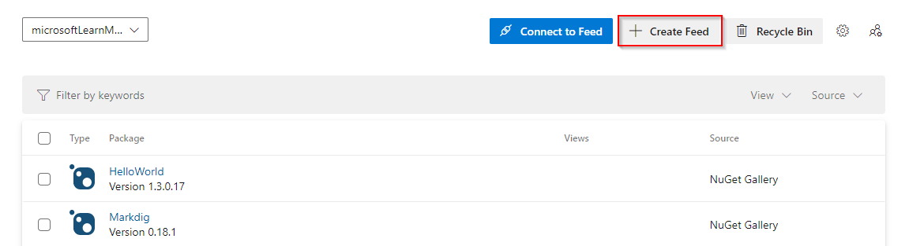
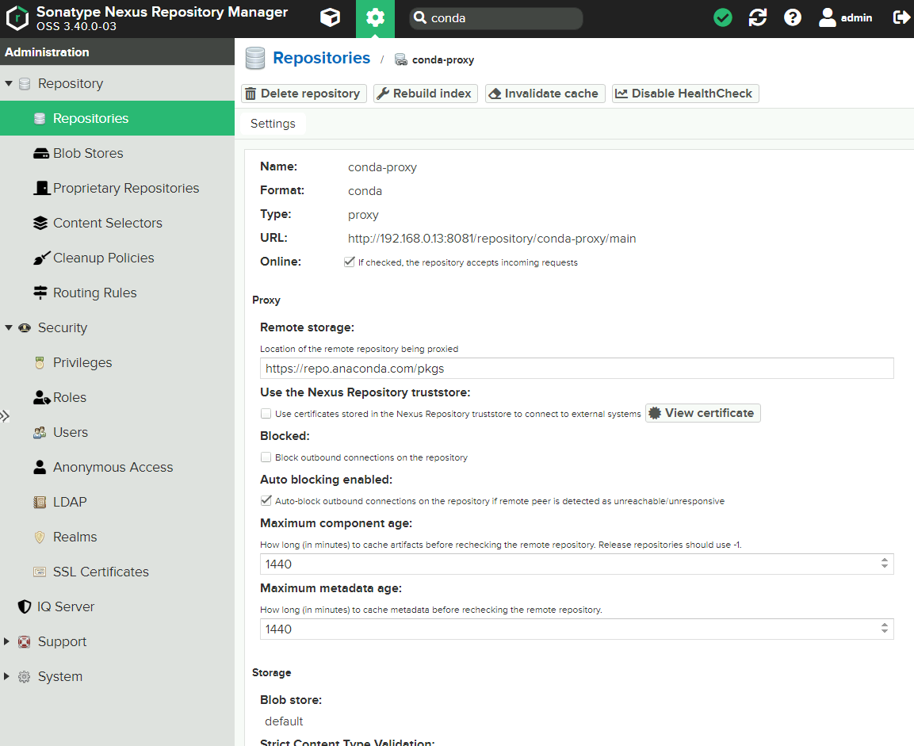
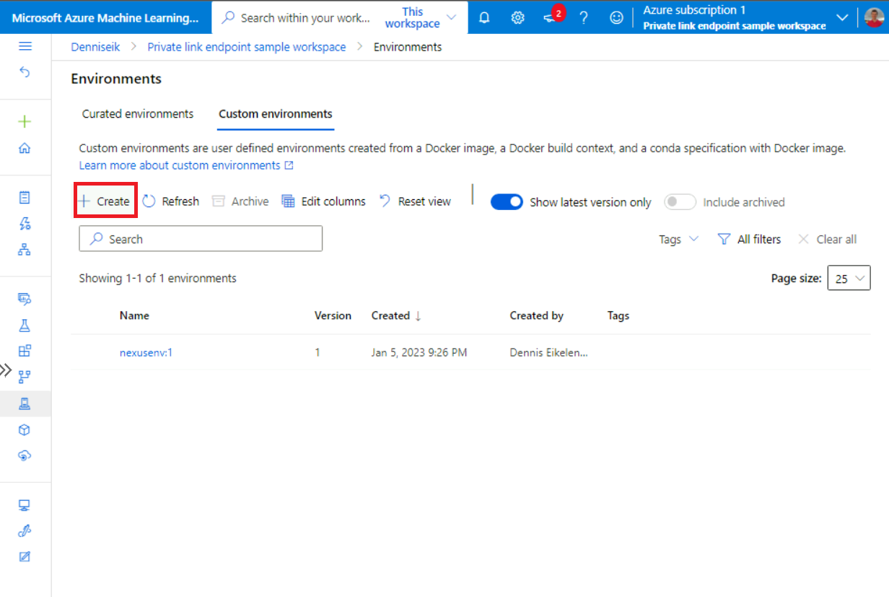
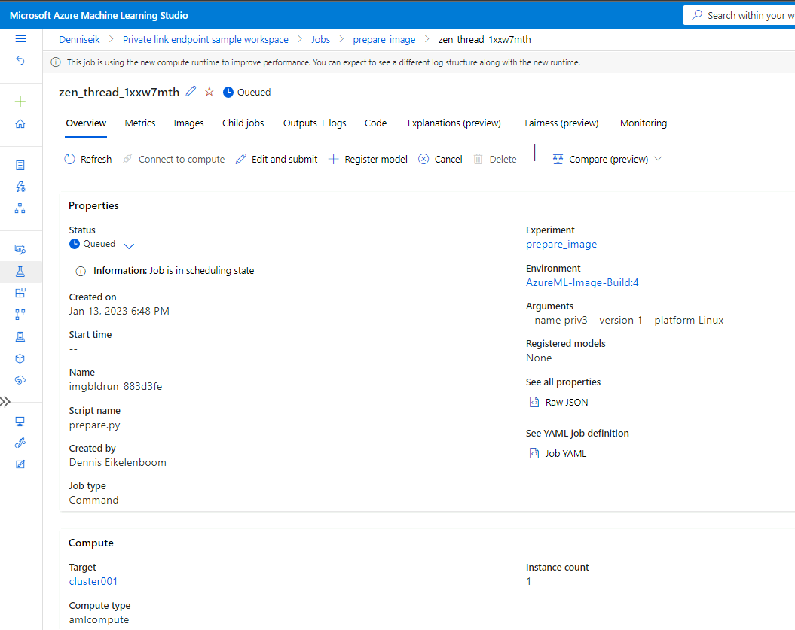

# Set up private package feeds with Azure ML

## Introduction

When working with [Azure Machine Learning](https://learn.microsoft.com/en-us/azure/machine-learning/), your security team may require the use of private package channels as part of the software build process. 

In this tutorial, we'll explain how you can configure your Azure Machine Learning environment to install packages from a private source. This includes:
1. Setting up a network-isolated Azure Machine Learning workspace, and set up a package feed host in the same Azure virtual network.
1. Configure Azure ML compute instances to use private package feeds.
1. Configure private feeds for Azure ML environment creation using CLI/SDK
1. Configure private feeds on Azure Machine Learning base images

## Step 1: Azure resource set up

1. Set up a network-isolated Azure Machine Learning environment [using this template](https://github.com/Azure/azure-quickstart-templates/tree/master/quickstarts/microsoft.machinelearningservices/machine-learning-end-to-end-secure). This creates:
   
   * An Azure virtual network
   * Azure Machine Learning workspace
   * Dependent Azure resource
   * A "jumpbox" virtual machine (to access the private environment): 
		
1. Set up your private package repository. Pick your preferred host:

   * [Azure Artifacts](https://learn.microsoft.com/en-us/azure/devops/artifacts/start-using-azure-artifacts?view=azure-devops)

       * Follow [Get started with Python packages in Azure Artifacts](https://learn.microsoft.com/en-us/azure/devops/artifacts/quickstarts/python-packages?view=azure-devops) to set up a python package feed.
           
       * Optionally, include packages from upstream sources such as PyPi.

   * [Sonatype Nexus OSS](https://azuremarketplace.microsoft.com/en-in/marketplace/apps/askforcloudllc1651766049149.nexus_repository_oss_on_ubuntu_20_04_lts?tab=Overview&exp=ubp8) - Instructions:
        
        * Follow the Azure Marketplace link above to deploy an Azure VM with Sonatype Nexus in the same VNET and subnet as the private link endpoint of the Azure Machine Learning workspace: `snet-training`.
        * SSH into your Azure VM to find the Nexus default credentials. The default username is “admin”. Run the below command on your Azure VM to find the Nexus portal default password. 
          ```
          cat /opt/sonatype-work/nexus3/admin.password
          ```
        * Note the private IP address of your VM. Connect to the machine in your private network [using Bastion](https://learn.microsoft.com/en-us/azure/bastion/bastion-connect-vm-rdp-windows#rdp).
        * From your jumpbox machine's browser, access the Nexus admin portal via http://{azure_vm_ip_address}:8081.
        * Create a Conda proxy following [Set up Sonatype Nexus Conda repository](https://help.sonatype.com/repomanager3/nexus-repository-administration/formats/conda-repositories).
            
        * Similarly, create a PyPi proxy following [Set up Sonatype Nexus Python repository](https://help.sonatype.com/repomanager3/nexus-repository-administration/formats/pypi-repositories) 


1. Access your [Azure Machine Learning workspace](http://ml.azure.com/)

## Step 2: configure Azure Machine Learning compute instance

Compute instance provides a managed workstation for data science, and comes with pre-installed with Conda and Python versions that point to public feeds for package management.

* Optionally, verify that your compute instance can connectto the private package host: 
  ```bash
  telnet <ip address> <port>
  ```

Run the following commands to configure `conda` to point to your private feeds:

* Add your private channel:
  ```bash
  conda config --add channels http://192.168.0.13:8081/repository/conda-proxy/
  conda config --add repodata_fns <repodata_file_on_your_server>.json
  ```
* Optionally, remove public channels:
  ```bash
  conda config --remove channels defaults \
  ```

* Azure Machine Learning compute instance comes packaged with pre-installed Conda environments. The default user has no privileges to modify these environments. You can create new conda environments, and modify packages using `sudo` permissions e.g.
  ```bash
  sudo /anaconda/condabin/conda install dask-ml
  ```

Run the following commands to configure `pip` to point to your private feed:

* Create a pip configuration file
  ```bash
  mkdir $HOME/.config
  mkdir $HOME/.config/pip
  touch $HOME/.config/pip/pip.conf
  ```

* Edit `pip.conf` using your favorite editor, to add the proxy indices and make sure your host is trusted by the client.
  ```bash
  [global]
  index = http://192.168.0.13:8081/repository/pypi-proxy/pypi/
  index-url = http://192.168.0.13:8081/repository/pypi-proxy/simple/
  trusted-host = 192.168.0.13
  ```

* Verify your configuration is correct using `pip config list`

* Optionally, create a [compute instance customization script](https://learn.microsoft.com/en-us/azure/machine-learning/how-to-customize-compute-instance) to automate the setup of new instances.

## Step 3: configure private feeds for environment creation using the Azure ML CLI/SDK

* To use your private feeds for environment creation, follow [Use a repository of packages from Azure DevOps feed](https://learn.microsoft.com/en-us/azure/machine-learning/v1/how-to-use-private-python-packages#use-a-repository-of-packages-from-azure-devops-feed).


## Step 4: configure private feeds on Azure Machine Learning base images

1. Use the Azure Machine Learning Studio UI or CLI/SDK to create a custom Azure ML environment
   

1. Add the following lines to your dockerfile to configure Conda and Pip:
   ```dockerfile
   # Configure conda private channels
   RUN conda config --set offline false \
   && conda config --remove channels defaults || true \
   && conda config --add channels http://192.168.0.13:8081/repository/conda-proxy/main

   # Configure pip private indices and ensure your host is trusted by the client
   RUN pip config set global.index http://192.168.0.13:8081/repository/pypi-proxy/pypi/ \
   &&  pip config set global.index-url http://192.168.0.13:8081/repository/pypi-proxy/simple/ \
   &&  pip config set global.trusted-host 192.168.0.13
   ```

   Your dockerfile would look [like this reference dockerfile](example.dockerfile).

1. Create your Azure ML environment, and under 'Jobs' in the Azure ML Studio check whether you image got succesfully build by checking the logs. See 'Outputs + logs'.
   

1. Optionally, publish your Azure ML environment to an Azure Machine Learning registry to reuse the created environment across workspaces.

## References

* [Vulnerability management for Azure Machine Learning](https://learn.microsoft.com/en-us/azure/machine-learning/concept-vulnerability-management)
* [Sonatype Nexus Conda repository](https://help.sonatype.com/repomanager3/nexus-repository-administration/formats/conda-repositories)
* [Sonatype Nexus Python repository](https://help.sonatype.com/repomanager3/nexus-repository-administration/formats/pypi-repositories)